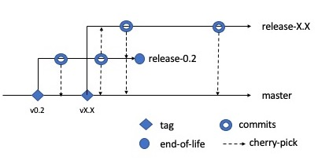

# Contributing to Fabric Devkit Helper

The maintainer(s) of this project welcomes feedback and contribution from anyone. 

To maintain some order in this project development lifecycle, the principal maintainer shall, currently, retain sole descretion in deciding any features to be incorporated or removed from this repository. 

It is worth emphasising that the long term goal is to have this project supported by multiple maintainers to ensure that there is no single-point-of-failure. A consensus mechanism that can enable this project involve multiple maintainers is currently being established.

## Development life cycle

The DevKit's development lifecycle is based on the trunk (master) and release methodology see Figure 1.

<figure>
    
    <figcaption>Figure 1: Trunk and release</figcaption>
</figure>

The master branch is where all the latest features are being developed.

Release branch are snapshots of master branch with features that have been earmarked for a stated deliverable version. No new features will be added to released branches. Often there will be a period where you will see a maximum two releases branches. This overlap will be temporary. Once the newer release is stablised, the older version will be designated end-of-life and the branch will be earmarked for deletion.

All bug fixes will be done on appropriate release branches and cherry-picked to the master branch and any live preceeding release branch.