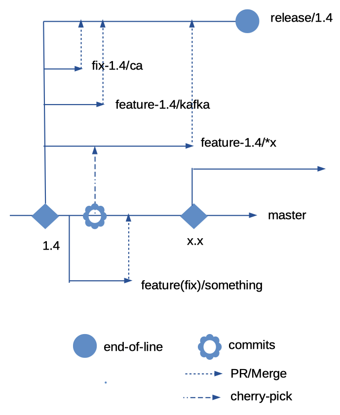

# Contributing to Fabric Devkit Helper

The maintainer(s) of this project welcomes feedback and contribution from anyone. 

However in order to contribute please ad here to the rules as described here.

## Pre-requisite

All contribution commits must be GPG signed and signed off i.e. `git commit -S -s`.

To set up for GPG signature, please refer to instuction [here.

## Development life cycle

The DevKit's development lifecycle is based on the trunk (master) and release methodology see Figure 1.

<figure>
    
    <figcaption>Figure 1: Trunk and release</figcaption>
</figure>

The master branch is where all the latest features are being developed.

Release branch are snapshots of master branch with features that have been earmarked for a stated deliverable version. No new features will be added to released branches. Often there will be a period where you will see a maximum two releases branches. This overlap will be temporary. Once the newer release is stablised, the older version will be designated end-of-life and the branch will be earmarked for deletion.

All bug fixes will be done on appropriate release branches and cherry-picked to the master branch and any live preceeding release branch.